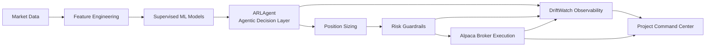
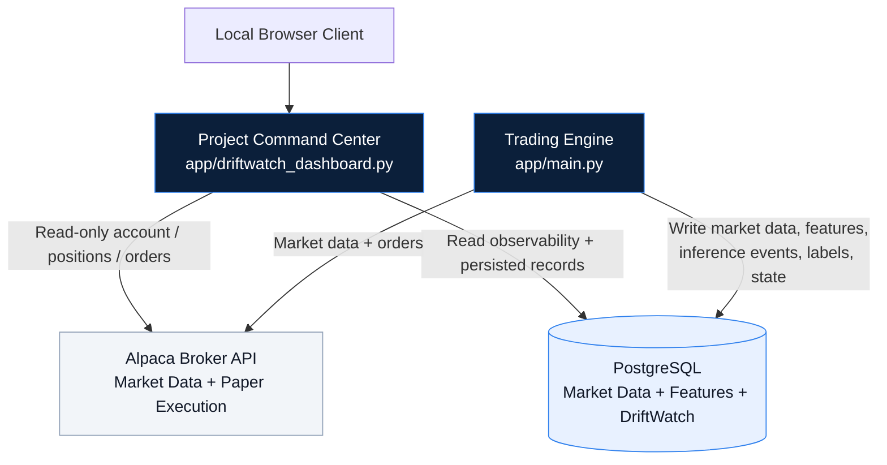
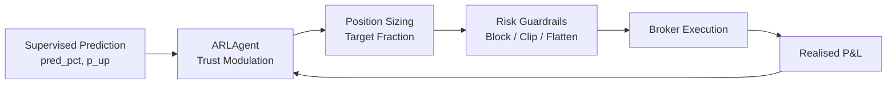

# Agentic E-Trading Engine

<p align="center">
  <strong>From Prediction to Risk-Aware Market Execution</strong>
</p>

<p align="center">
  
  
  
  
  
  
</p>

---

## 30-Second Overview

**Alpaca** is a production-oriented **paper-trading system** that connects machine-learning prediction to real broker execution under strict risk controls.

It is not just a stock predictor and it is not an end-to-end black-box reinforcement learning bot.

It is a modular trading platform where:

```text
Prediction ≠ Decision ≠ Position Sizing ≠ Risk Control ≠ Execution
```

The system combines:

- supervised ML models for next-hour return prediction,
- an online contextual bandit called **ARLAgent** that adapts trust in each symbol,
- a position-sizing layer that converts signals into target exposure,
- seven hard risk guardrails that can override any trade,
- Alpaca paper-trading execution,
- PostgreSQL persistence,
- DriftWatch inference/label observability,
- and a local Python **Project Command Center** for full-system inspection.

> This repository is an academic graduation project. It demonstrates an end-to-end, inspectable, risk-bounded trading architecture. It does **not** claim statistically proven profitability and it is **not financial advice**.

---

## What This Is and What This Is Not

| This project is | This project is not |
|---|---|
| A production-oriented paper-trading prototype | A guaranteed profitable trading strategy |
| An end-to-end trading system architecture | Financial advice |
| A modular ML + agentic decision engine | A black-box deep RL policy |
| A system with real broker integration | A fully hardened live trading product |
| A risk-bounded execution pipeline | A replacement for proper backtesting |
| A local inspection and observability platform | A public production dashboard |

---

## Why This Project Exists

Modern financial markets are noisy, non-stationary, and operationally unforgiving.

A model can have decent offline predictive performance and still lose money once it meets:

- transaction costs,
- slippage,
- short availability,
- session boundaries,
- leverage constraints,
- drawdowns,
- broker rejections,
- and changing market regimes.

The central design question is:

> How do we build a trading system that is predictive, adaptive, risk-bounded, and inspectable?

This project answers that question with a layered architecture.

---

## High-Level Pipeline



---

## System Architecture

The system is organised into four cooperating components.



### Key Architectural Rule

The **trading engine is the only component allowed to submit broker orders**.

The Project Command Center is observational. It can inspect broker/account state, persisted records, project metadata, and DriftWatch tables, but it never submits orders and never mutates the trading engine's runtime state.

---

## Core Capabilities

| Capability | Implemented Through |
|---|---|
| Market data ingestion | Alpaca market data API |
| Feature engineering | Live feature pipeline in `app/main.py` |
| Supervised prediction | XGBoost + ElasticNet ensemble |
| Agentic modulation | `ARLAgent` contextual bandit |
| Position sizing | Volatility-normalised signal mapping |
| Risk control | Seven-layer guardrail cascade |
| Broker execution | Alpaca paper-trading API |
| Fill accounting | `BlockLedger` |
| Persistence | PostgreSQL |
| Observability | DriftWatch inference and label tables |
| Inspection interface | Local Python Project Command Center |
| Validation | Unit tests, integration tests, paper-trading checks |

---

## Repository Structure

```text
Alpaca/
│
├── app/
│   ├── __init__.py
│   ├── main.py                     # Main trading engine and block loop
│   ├── execution.py                # BlockLedger and realised P&L accounting
│   ├── driftwatch_client.py         # DriftWatch PostgreSQL writer
│   ├── driftwatch_dashboard.py      # Local Project Command Center
│   ├── feat_cols.json              # Final model feature manifest
│   ├── universe.csv                # Trading universe
│   │
│   ├── agent/
│   │   ├── __init__.py
│   │   └── arl_agent.py            # ARLAgent contextual bandit
│   │
│   └── model/
│       ├── XGboost_model.json      # XGBoost model artefact
│       └── elasticnet_ret1h.pkl    # ElasticNet model artefact
│
├── schema/
│   ├── market_data.sql             # Market data and feature snapshot schema
│   └── driftwatch.sql              # Inference and label event schema
│
├── tests/
│   ├── test_agent.py
│   ├── test_execution.py
│   ├── test_driftwatch_client.py
│   └── test_driftwatch_dashboard.py
│
├── requirements.txt
├── README.md
└── .env.example
```

---

## Quickstart

### 1. Clone the Repository

```bash
git clone https://github.com/ElMolla10/Alpaca.git
cd Alpaca
```

### 2. Create a Python Environment

Recommended Python version:

```text
Python 3.11+
```

Using `venv`:

```bash
python3.11 -m venv .venv
source .venv/bin/activate
```

Or using `uv`:

```bash
uv python install 3.11.9
uv venv --python 3.11.9 .venv
source .venv/bin/activate
```

### 3. Install Dependencies

```bash
pip install -r requirements.txt
```

### 4. Configure Environment Variables

```bash
cp .env.example .env
```

Then edit `.env` with your Alpaca paper-trading credentials and database connection string.

### 5. Run the Local Project Command Center

```bash
python -m app.driftwatch_dashboard --host 127.0.0.1 --port 8765
```

Open:

```text
http://127.0.0.1:8765
```

### 6. Run the Trading Engine

In a separate terminal:

```bash
python -m app.main
```

---

## Project Command Center

The **Project Command Center** is the local inspection interface for the entire system.

It is implemented in:

```text
app/driftwatch_dashboard.py
```

Run it with:

```bash
python -m app.driftwatch_dashboard --host 127.0.0.1 --port 8765
```

Open:

```text
http://127.0.0.1:8765
```

### Command Center Pages

```text
/overview
/trading
/architecture
/agent
/risk
/driftwatch
/validation
/config
/roadmap
```

### What It Shows

| Page / Area | Purpose |
|---|---|
| Overview | High-level system summary |
| Trading | Account status, equity, cash, positions, orders |
| Architecture | System modules and data flow |
| Agent | ARLAgent behaviour and risk profiles |
| Risk | Seven-layer guardrail cascade |
| DriftWatch | Inference events, labels, latency, realised outcomes |
| Validation | Testing and operational evidence |
| Config | Environment and dependency status |
| Roadmap | Future-work directions |

### Security Boundary

By default, the command center binds to:

```text
127.0.0.1
```

It is intended for local inspection, demonstration, and academic evaluation.

Do not expose it publicly without adding:

- authentication,
- access control,
- transport hardening,
- proper secret management,
- network restrictions,
- logging,
- monitoring,
- and operational incident procedures.

---

## Dataset and Feature Engineering

The project uses historical hourly equity bars for supervised model training and live hourly bars for decision-time inference.

### Raw Bar Fields

```text
open
high
low
close
volume
vwap
```

### Final Model Feature Manifest

The final predictive model consumes the feature manifest stored in:

```text
app/feat_cols.json
```

Current model-input features:

```json
[
  "open",
  "high",
  "low",
  "close",
  "volume",
  "vwap",
  "price_change_pct_lag1",
  "price_change_pct_lag2",
  "price_change_pct_lag3",
  "vol20",
  "ret5"
]
```

### Feature Engineering Principles

The pipeline enforces:

- regular-hours filtering,
- strict no-lookahead construction,
- lag shifting,
- rolling volatility calculation,
- momentum features,
- live/training feature parity,
- and a stable explicit feature manifest.

Additional indicators such as MACD and Bollinger Band values may be computed for diagnostics or future feature expansion, but the trained model consumes the explicit feature manifest above.

---

## Supervised Prediction Layer

The supervised prediction layer produces a next-hour directional return estimate.

### XGBoost

Model artefact:

```text
app/model/XGboost_model.json
```

Purpose:

- non-linear tabular prediction,
- interaction capture,
- robust baseline for financial features.

### ElasticNet

Model artefact:

```text
app/model/elasticnet_ret1h.pkl
```

Purpose:

- regularised linear baseline,
- robustness in low-signal regimes,
- complementary failure mode to XGBoost.

### Ensemble

The system uses a simple average ensemble:

```text
ensemble_prediction = (xgboost_prediction + elasticnet_prediction) / 2
```

The ensemble produces:

- `pred_pct` — predicted next-hour return,
- `p_up` — pseudo-probability of upward move,
- volatility estimate for sizing and confidence logic.

The prediction layer does not directly decide final trades. It provides the directional signal that the agent and risk system inspect.

---

## ARLAgent

The **ARLAgent** is an online contextual bandit that modulates trust in the supervised model.

It is implemented in:

```text
app/agent/arl_agent.py
```

### Why a Bandit?

A full deep RL trading policy is difficult to debug and risky to deploy.

A contextual bandit gives a smaller, more interpretable adaptation layer:

- each symbol acts like an arm,
- recent realised performance updates belief,
- confidence changes how aggressively the model signal is trusted,
- exploration decays over time but never fully disappears.

### Agent Inputs

The agent considers:

- symbol-level momentum,
- volatility,
- liquidity proxy,
- time to close,
- day-of-week context,
- realised reward history,
- active risk profile.

### Agent Outputs

For each selected symbol, the agent produces a `Decision`:

```text
allow
band override
EMA half-life override
size multiplier
minimum hold duration
```

### Reward Signal

The reward is:

```text
realised after-cost P&L percentage
```

This is calculated by the `BlockLedger` after positions close.

### Confidence Transformation

The per-symbol reward EMA is transformed into confidence:

```text
confidence = sigmoid(0.8 × reward_ema)
```

This confidence controls:

- volatility-normalisation band,
- position EMA half-life,
- size multiplier,
- minimum hold duration.

---

## Predict-then-Modulate

The central idea is:

```text
Supervised model predicts.
Agent decides how much to trust.
Sizing converts trust-adjusted signal into exposure.
Risk guardrails can override everything.
```



This is the project's practical interpretation of the Predict-then-Optimise idea: predictive error and decision quality are related, but not identical. The agent acts as the online bridge between prediction and realised economic outcome.

---

## Position Sizing

The position-sizing layer converts the modulated signal into a target position fraction.

It applies:

1. volatility-normalised signal mapping,
2. power-law transformation,
3. EMA smoothing,
4. per-block delta cap,
5. absolute position cap,
6. notional conversion.

The goal is to avoid turning noisy predictions into unstable allocations.

---

## Risk Guardrails

Risk is enforced externally, not learned inside the agent.

The system applies seven independent guardrail layers:

| Layer | Guardrail | Default Behaviour |
|---|---|---|
| 1 | Daily drawdown throttle | Scale subsequent targets by `0.70` after soft drawdown |
| 2 | Daily drawdown kill | Flatten all positions and stop trading |
| 3 | Trading cut-off | Block new entries near market close |
| 4 | Friday late-session rule | Reduce size and block new weekend-spanning entries |
| 5 | Per-symbol gross cap | Clip absolute exposure per symbol |
| 6 | Leverage headroom guard | Skip or clip orders near leverage limit |
| 7 | End-of-day flattening | Flatten all open positions before close |

### Why External Guardrails?

Because no learned policy should be trusted with the final say on capital protection.

The agent can propose. The risk layer decides whether the proposal is allowed.

---

## Execution Layer

The execution layer bridges target exposure and Alpaca paper-trading orders.

It handles:

- long notional orders,
- short quantity orders,
- broker rejection handling,
- short availability parsing,
- leverage headroom checks,
- minimum position thresholds,
- fill recording,
- slippage modelling,
- commission modelling,
- per-symbol realised P&L calculation.

Main execution file:

```text
app/execution.py
```

Order coordination lives in:

```text
app/main.py
```

---

## DriftWatch Observability

DriftWatch is the inference and label observability layer.

It is not the whole dashboard. It is one observability section inside the Project Command Center.

### `inference_events`

Each prediction event records:

- timestamp,
- model ID,
- model version,
- request ID,
- prediction type,
- latency,
- feature JSON,
- predicted value,
- segment metadata.

### `label_events`

Each realised label records:

- timestamp,
- request ID,
- realised P&L label,
- label type,
- additional metadata.

Together, these tables reconstruct:

```text
Prediction → Decision → Execution → Realised Outcome
```

This enables:

- offline model evaluation,
- predicted-vs-realised analysis,
- feature distribution inspection,
- future retraining,
- future drift monitoring,
- future alerting.

---

## PostgreSQL Persistence

PostgreSQL stores:

| Table / Area | Purpose |
|---|---|
| `market_data` | Idempotent OHLCV bar persistence |
| `feature_snapshots` | Feature vector at each decision epoch |
| `inference_events` | DriftWatch inference records |
| `label_events` | Realised labels linked to inference events |

The design allows the system to recover not only what it did, but why it did it.

---

## Environment Variables

### Core Broker and Database Variables

```bash
APCA_API_KEY_ID=
APCA_API_SECRET_KEY=
APCA_API_BASE_URL=https://paper-api.alpaca.markets
ALPACA_DATA_FEED=iex

DRIFTWATCH_DATABASE_URL=
DATABASE_URL=
```

### Model and Feature Paths

```bash
MODEL_PATH_XGB=app/model/XGboost_model.json
MODEL_PATH_ENET=app/model/elasticnet_ret1h.pkl
FEATS_PATH=app/feat_cols.json
```

### Agent Settings

```bash
AGENTIC_MODE=1
USER_STYLE=high_risk_short_term
AGENT_MAX_SYMBOLS=20
```

Available user styles include:

```text
high_risk_short_term
medium_risk_swing
low_risk_long_term
```

### Trading Session Settings

```bash
SESSION_START_H=10
BLOCK_MINUTES=60
TRADE_CUTOFF_MIN_BEFORE_CLOSE=30
EOD_FLATTEN_MIN_BEFORE_CLOSE=2
```

### Risk Settings

```bash
DAY_THROTTLE_DD_PCT=0.7
THROTTLE_SIZE_MULT=0.70
DAY_KILL_DD_PCT=1.0

FRIDAY_LATE_CUTOFF_H=14
FRIDAY_SIZE_MULT_DAY=0.85
FRIDAY_SIZE_MULT_LATE=0.60
FRIDAY_BLOCK_NEW_AFTER_LATE=1

PER_SYM_GROSS_CAP=0.05
```

### Position Sizing

```bash
BASE_NOTIONAL_PER_TRADE=3000
MAX_NOTIONAL=10000
MAX_POS=0.75
MIN_ABS_POS=0.02
DPOS_CAP=0.10
REBALANCE_BAND=0.01
```

### Cost Model

```bash
TRADE_COST_BPS=8.0
SLIPPAGE_BPS=4.0
```

---

## Running the System

### Run the Trading Engine

```bash
python -m app.main
```

The engine will:

1. Load environment variables.
2. Load model artefacts.
3. Load the feature manifest.
4. Connect to Alpaca.
5. Compute the market session.
6. Fetch recent market data.
7. Compute live features.
8. Generate model predictions.
9. Ask the ARLAgent for decisions.
10. Convert decisions to target positions.
11. Apply risk guardrails.
12. Submit paper orders.
13. Record fills.
14. Log DriftWatch inference events.
15. Persist engine state.

### Run the Project Command Center

```bash
python -m app.driftwatch_dashboard --host 127.0.0.1 --port 8765
```

Then open:

```text
http://127.0.0.1:8765
```

The command center can run even if broker or database credentials are absent. The affected sections will report explicit offline or unavailable states.

---

## Testing

Run all tests:

```bash
pytest
```

Run with coverage:

```bash
pytest --cov=app
```

Compile-check the app:

```bash
python -m compileall app
```

Recommended verification before a demo:

```bash
python -m compileall app
pytest
python -m app.driftwatch_dashboard --host 127.0.0.1 --port 8765
```

---

## Validation Strategy

The validation strategy is operational rather than profitability-driven.

The project validates whether the system behaves correctly, not whether the strategy is statistically proven profitable.

### Unit Tests

Validated behaviours include:

- agent universe filtering,
- ε-greedy selection,
- ε decay,
- confidence interpolation,
- temporal gates,
- reward EMA correctness,
- agent persistence round-trip,
- BlockLedger long/short round trips,
- empty ledger behaviour,
- ledger reset and clear-symbol behaviour.

### Integration Tests

Validated integrations include:

- engine ↔ database,
- engine ↔ broker,
- Project Command Center pages/API,
- Project Command Center ↔ broker,
- Project Command Center ↔ DriftWatch database,
- offline demonstration mode.

### Paper-Trading Validation

The engine was exercised against Alpaca paper trading to validate:

- account reads,
- market-data reads,
- paper order submission,
- position flattening,
- short availability handling,
- risk guardrail triggering,
- end-of-day flattening,
- state persistence.

---

## Known Limitations

Current limitations:

- no rigorous walk-forward backtest with statistical significance tests yet,
- static slippage model,
- single broker,
- single account,
- hourly bars only,
- US large-cap equities only,
- no options/futures support,
- no public dashboard hardening,
- DriftWatch currently supports inspection, not full automated alerting or retraining.

---

## Future Work

Planned or recommended extensions:

- walk-forward backtesting with bootstrap confidence intervals,
- slippage model conditioned on liquidity, volatility, and time of day,
- explicit market-regime detection,
- full DriftWatch monitoring with statistical drift tests,
- automated retraining triggers,
- multi-broker support,
- multi-account portfolio allocation,
- options support with Greeks-aware guardrails,
- crypto support for 24/7 markets,
- decision-loss-aware retraining inspired by Smart Predict-then-Optimise.

---

## Academic Framing

This project demonstrates that a small team can build a modular, inspectable, risk-bounded agentic trading prototype within the scope of a graduation project.

The key contribution is not a black-box profitable model.

The key contribution is a clean system architecture:

```text
Prediction
   ≠
Decision
   ≠
Position sizing
   ≠
Risk control
   ≠
Execution
```

Each layer is isolated, testable, replaceable, and observable.

---

## Safety Notice

This repository is for academic and educational purposes.

Do not use it with live capital without:

- rigorous walk-forward backtesting,
- broker reconciliation,
- improved slippage modelling,
- live-market risk review,
- secret management,
- monitoring and alerting,
- manual kill-switch procedures,
- legal and compliance review.

Trading involves risk. Paper-trading results do not guarantee live-trading performance.

---

## Team

- Mohamed Ehab
- Abdelrahman Tamer
- Mohamed Atef
- Yahia Abdelmonaem
- Moataz Kamal

Supervisor:

- Dr. Ammar Mohamed

Institution:

- ESLSCA University, School of Computing & Digital Technology

---

## Final Takeaway

**Alpaca is a complete agentic trading-system prototype, not merely a prediction notebook.**

It connects:

```text
Market data
→ Feature engineering
→ Supervised prediction
→ Agentic modulation
→ Position sizing
→ Risk guardrails
→ Broker execution
→ Observability
→ Full-system inspection
```

The result is an end-to-end, modular, inspectable, paper-trading platform designed around one principle:

> A trading model is only useful when it can be executed, constrained, observed, and improved safely.
